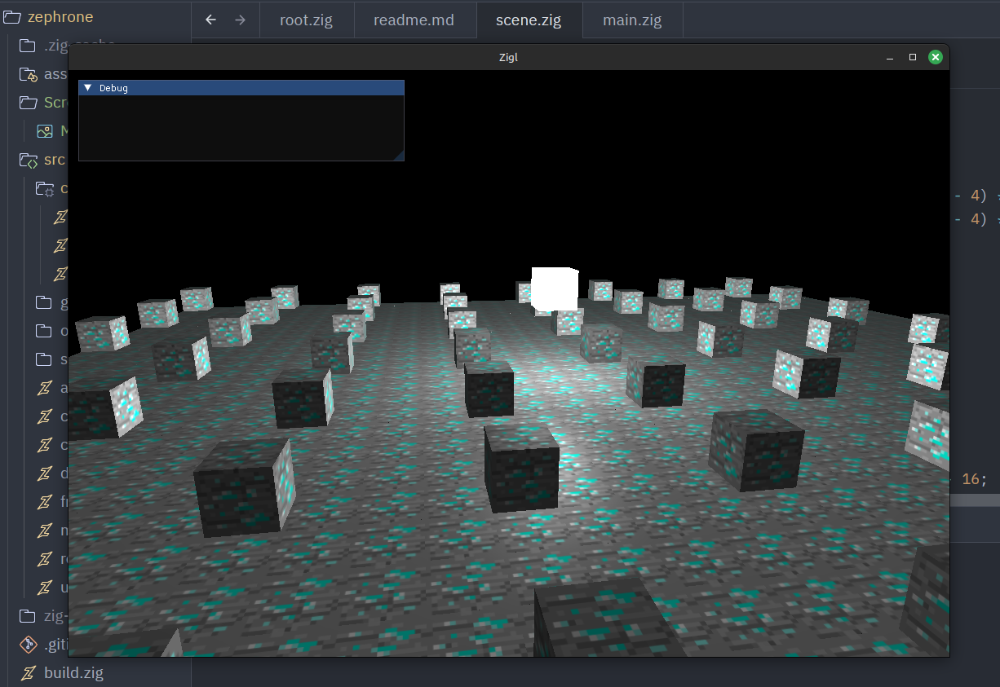

# Zephrone Engine (currently under development)
A very simple real‑time 3D rendering engine built from scratch in Zig + OpenGL.
Designed to explore low‑level graphics programming, real‑time rendering techniques, and modern GPU pipeline design.

  

## Overview
This isn't meant to be the next Godot or replace anything; it's built for me to learn how graphics work. It's an opportunity rather than anything else.

## Motivation
As mentioned earlier, the motivation started the day I wondered how computers deal with graphics. Although it was quite complicated for me as a young student, I find graphics pipelines very interesting. I also heard from a professional: "Writing a graphics engine is easier than using one, but only if you know how to construct programs."

## Design Goals
- Explicit control over GPU resources
- Modular renderer architecture
- Reduce OpenGL state-management chaos
- Preserve performance without sacrificing clarity
- Leverage Zig for low-level engine development

## Key Features
- [X] Custom OpenGL abstraction layer
- [X] Shader management system
- [X] Modular Event System
- [X] Singleton Input State
- [ ] Resource lifetime management
- [ ] Scene graph or ECS
- [X] Debug visualization tools

## Why Zig
When it comes to graphics programming, you have very few options due to the low-level access you need, or you can risk your performance. Although it's a very simple graphics engine prototype, I've preferred to keep it simple (KISS).
I could use Rust and fight with the borrow-checker or learn new concepts late at night. I could use C++ and make it terribly unmaintainable. But I couldn't use raw C, so I've picked Zig as a simple & WYSIWYG language: no hidden layers or magic syntax, just pure logic. You don't even have interfaces, but that's pretty cool.

### NOTICE: following log is a FALSE-POSITIVE
this is caused because zgui library uses some c library that uses static and zig checks before defering the memory

`info: [zgui] Possible memory leak or static memory usage detected: (address: 0x282cfc50, size: 128)`
